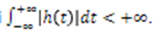
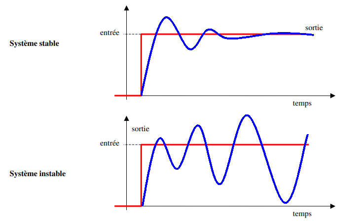
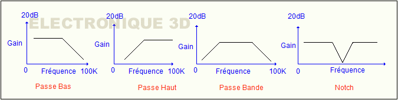

<iframe src="https://giphy.com/embed/TrUEzfsUTPEBi" height="150" frameBorder="0" class="giphy-embed" allowFullScreen></iframe>

## Principe de stabilité

On dit que le système est stable si pour une entrée bornée, la sortie reste bornée quelles que soient les perturbations
L’entrée est bornée si : 

 
Avec une réponse du système  

On montre que la sortie est bornée si   

Ainsi, un système est stable uniquement si sa réponse impulsionnelle est intégrable.

 
## Principe de filtrage
Un filtre linéaire est, en traitement du signal, un système qui applique un opérateur linéaire à un signal d'entrée.
Le filtrage a comme objectif de contrôler et sélectionner certaines fréquences du signal et éliminer les autres.

Les filtres les plus communs sont les suivants : 

Les filtres passe-bas laissent passer les basses fréquences et atténuent les hautes fréquences, c'est-à-dire les fréquences supérieures à la fréquence de coupure fc .

> Ces filtres sont par exemple utilisés dans le signal audio pour atténuer les aigües et amplifier les basses

Les filtres passe-haut font passer les hautes fréquences et atténuent les basses fréquences, c'est-à-dire les fréquences inférieures à la fréquence de coupure fc.

> Ces filtres sont par exemple utilisés dans le signal audio pour atténuer les basses et amplifier les aigües ainsi que dans le traitement de l'image pour accentuer le contour.

Les filtres passe-bande ne laissent passer qu'une bande ou intervalle de fréquences compris entre une fréquence de coupure basse et une fréquence de coupure haute du filtre. Ce filtre est une combinaison de filtre passe-haut et un filtre passe-bas.

Les filtres coupe-bande ou Notch, à l'inverse, laissent passer toutes les fréquences, sauf une bande ou intervalle de fréquences compris entre une fréquence de coupure basse et une fréquence de coupure haute du filtre.

> Les filtres passe-bande sont fondamentaux pour la réception radio et forment l'essentiel des égaliseurs audio.

