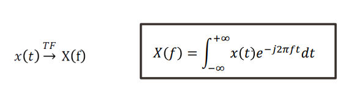
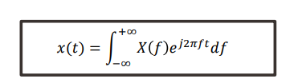
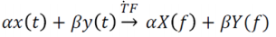
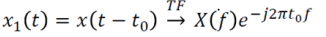
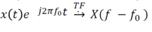
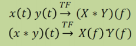
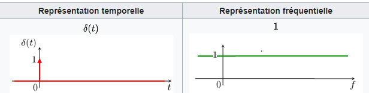
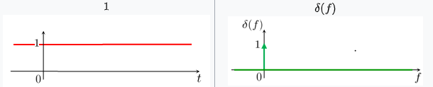

## La transformée de Fourier
La transformée de Fourier est l'outil qui permet de passer d'une représentation temporelle à une représentation fréquentielle (spectre du signal).

> La Transformée de Fourier est une généralisation de la DSF, elle s’applique à tous les signaux.

Soit signal 𝑥(𝑡) un signal ➢ continu / continu par morceaux et intégrable une fois ou à énergie finie ou à puissance finie. La Transformée de Fourier TF 𝑋(𝑓) de 𝑥(𝑡) est définie par : 

𝑋(𝑓) indique la "quantité" de fréquence f présente dans le signal 𝑥(𝑡) sur l'intervalle des réels. Il donne des informations fréquentielles sur x(t). 
Transformée de Fourier inverse :

### Propriétés : 

Linéarité : 

Retard : 

Translation fréquentielle : 

Produits : 

## Identité de Parseval 

> Pour les signaux à énergie finie on a la loi de conservation de l'énergie :  
> La transformée de Fourier conserve l’énergie du signal. 

Vitesse de variation temporelle et richesse spectrale : 
Si 𝑥(𝑡) est très « rapide », sa TF sera très étalée : exemple du Dirac : 

A l’inverse : Si 𝑥(𝑡) est très « lent », sa TF sera très « pointue » : exemple de la fonction constante :

 
En ce qui concerne l’intérêt la Transformée de Fourier pour les SLIT, elle permet une meilleure visualisation sur un signal. 
