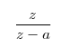

<iframe src="https://giphy.com/embed/MMWA9EJgz6MRG" height="150" frameBorder="0" class="giphy-embed" allowFullScreen></iframe><p></p>

## La transformée en Z


C’est un outil mathématique qui est l’équivalent discret de la transformation de Laplace. Elle permet de transformer un signal x(n) discret en une suite mathématique.  
 
Elle possède de plus un lien avec la transformée de Fourier à Temps Discret TFTD :  

En effet X(z) = X(f) pour z=e^(j2πfTe) avec Te=1/Fe et Fe la fréquence du signe d’échantillonnage de la suite {xn} .
Comme dit précédemment, cet outil mathématique permet de faciliter le traitement des signaux discret comme la synthèse des filtres numériques ou la prise en compte des retards.  


## Condition d’existence de la TZ

La TZ existe si l'équtation suivante converge.  


D’où d’après le critère de Cauchy : la TZ existe si:


## Propriétés

La TZ est linéaire càd :
```
TZ(a*x(n)+y(n))=a*TZ(x(n))+TZ(y(n)) 
```
Nous pouvons retarder un signal de n0Te en multipliant la transformée par z^(-n0).  

La TZ transforme une convolution en produit simple :


## TZ usuelles :  


Suites | Transformée en Z | Domaine de convergence
|:---:|:---:|:---:|
`u0=1 et un=0 si n>0`  | `1` | `ℂ` 
`uk=1 et un=0 si n!=k` | `z^-k` | `ℂ*`
`1` |  | <code>&#124;z&#124;>1</code>
`n` |  | <code>&#124;z&#124;>1</code>
`a^n` |  | <code>&#124;z&#124;>a</code>
`n*a^n` |  | <code>&#124;z&#124;>a</code>
`cos(wn)` |  | <code>&#124;z&#124;>1</code>
`sin(wn)` |  | <code>&#124;z&#124;>1</code>
`a^n*cos(wn)` |  | <code>&#124;z&#124;>a</code>
`a^n*sin(wn)` |  | <code>&#124;z&#124;>a</code>

## La transformée en Z inverse : TZ^-1 :  


Pour trouver le signal x(n) à partir de sa transformée en z, nous allons procéder par décomposition en fractions partielles :  

TZ est souvent sous forme de fraction rationnelle -> Décomposition en éléments simple puis recherche des fonctions inverses d’après le tableau des TZ usuelles.  


## Equation aux différences :  

Les systèmes réalisables vérifient une équation appelée équation aux différences qui relie l’entrée et la sortie du système. Nous avons la relation:
 

> Exemple : </br>
> Cette équation permet alors de construire la fonction de transfert, ici :  </br>
> 
> Car la fonction de transfert est de la forme H(z) = Y(Z)/X(Z). 


