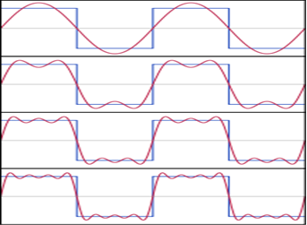
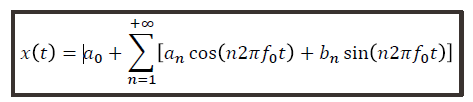
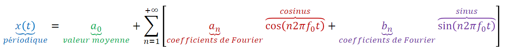
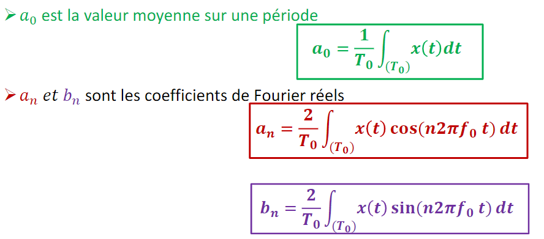
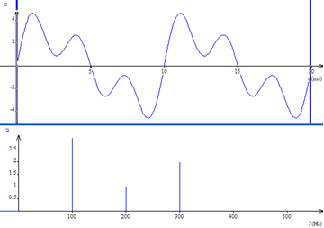
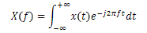
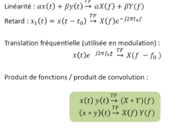

<iframe src="https://giphy.com/embed/BmmfETghGOPrW" height="150" frameBorder="0" class="giphy-embed" allowFullScreen></iframe>

## Définitions et Propriétés
 
Tout signal réel périodique 𝑥(𝑡): ℝ→ℝ, de période 𝑇0 et de fréquence 𝑓0 = 1/ 𝑇0 
continu ou continu par morceaux sur une période et intégrable au moins une fois sur une période peut se décomposer en une somme finie ou infinie de sinus et/ou de cosinus de fréquence multiple de 𝑓0. 
Cette somme s’appelle DSF. 

## Principe
Exprimer le signal 𝑥(𝑡) de période 𝑇0 comme une combinaison linéaire de fonctions sinusoïdales de fréquences multiples de 𝑓0, dite fréquence fondamentale. 
 
La forme trigonométrique réelle de la DSF est :

 
## Représentation spectrale
 
On représente le spectre d’un signal par le module des coefficients complexes de Fourier pour 
chaque fréquence 𝑛𝑓0 on représente le point où 𝑛 ∈ ℤ  
 
Pour un signal réel, le spectre est symétrique 
 
Décomposition en série de Fourier d’un signal sonore 

 
## Comment faire pour les signaux non périodiques ?
 
Puisque la DSF s’applique uniquement aux signaux périodiques, nous avons besoin d’un outil qui nous permettra de passer d’une représentation temporelle a une représentation fréquentielle qui est applicable a tous les signaux. 

C’est la qu’intervient la Transformée de Fourier généralisée (TF). 

> Pour un signal x(t) qui est :
> - à puissance ou énergie finie
> - Continu ou continu par morceaux et intégrable

La Transformée de Fourier X(f) de ce signal x(t) peut s’écrire de la forme suivante : 

Voici quelques propriétés de la transformée de Fourier :

