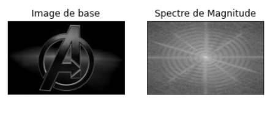
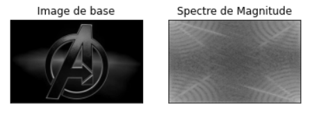
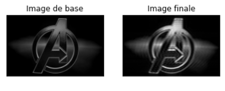

## Introduction

Cette application utilise les différentes notions de FFT et filtres (passe-haut/passe-bas) déjà appliquées sur des signaux, mais cette fois-ci appliquées sur des images.

Nous allons voir comment faire passer des données en 2 Dimensions dans le domaine fréquenciel, pour y appliquer des filtres et ainsi procéder à certaines opérations sur des images.

## Importation

> Pour avoir le template du TP faites **Copier sur Drive** depuis ce lien : [Google Colab](https://colab.research.google.com/github/MarcEtienneDartus/Financial-Processing-Lab/blob/master/images.ipynb)

### Importation des librairies:

Nous utliserons 3 libraires au cours de l'application :

- cv2 permet de charger les images.
- pyplot permet d'afficher les images
- numpy est une librairie de calcul de de structure de données qui nous fournit des fonctions de traitement.

Vous pouvez les importer comme ceci:

```python
import cv2
import numpy as np
from matplotlib import pyplot as plt
```

### Importation de l'image

Vous pouvez utilisez n'importe quelle image ou prendre celle avec lesquelle nous avons effectuer l'application : [image](https://qph.fs.quoracdn.net/main-raw-550078124-appwyhhxaubrsryytlrprbmqtpaxvbhc.jpeg).

Pour importer l'image sur colab procodédez avec ```files.upload``` de ```google.colab```:

```python
from google.colab import files
files.upload()
```

Une fois l'image chargée sur colab, vous pourrez la charger sous forme de matrice grâce à la fonction suivante 

```python
img = cv2.imread('The-Avengers-Logo.jpg',0)
```
> Remplacez le nom de l'image chargée si vous de ne travaillez pas avec 'The-Avengers-Logo.jpg'.

## Lecture préambule

Attention, étant donné que nous travaillons avec une image, nous n'utiliserons pas une simple fft mais une fft 2-Dimensions.

Voici des explications sur l'utilisation de la fonction ```fft(a,n)``` de ```numpy``` :

La DFT (Discret Fourier Transform) est de façon générale définie pour les entrées et les sorties complexes, c'est un composant à fréquence unique à la fréquence linéaire f qui est représenté par un exponentiel complexe am=exp{2πifmΔt}, où Δt est l’intervalle pour l’échantillonnage.


Voici les fonctions fft de Numpy et les valeurs dans le résultat :

- A=fft(a,n)
  - A[0] contient le terme de fréquence zéro qui est la moyenne du signal. Il est toujours purement réel pour les entrées réelles.
  -A[1:n/2] contient les termes de fréquence positive.
  -A[n/2+1:] contient les termes de fréquence négative dans l’ordre de fréquence négative décroissante
  -A[n/2] représente la fréquence Nyquist positive et négative pour un nombre pair de points d’entrée. Il est également purement réel pour l’entrée réelle.
  -A[(n−1)/2] contient la plus grande fréquence positive pour un nombre impair de points d’entrée.
  -A[(n+1)/2] contient la plus grande fréquence négative.
- fftfreq(n)
retourne un tableau donnant les fréquences des éléments correspondants dans la sortie.
- fftshift(A)
transforme les décalages et leurs fréquences pour placer les composants à fréquence zéro au milieu.
- ifftshift(A)
Inverse de fftshift(A).


Quand a est un signal temporel, on a dans A=fft(a):

1. abs(A) : l'amplitude du spectre
2. {abs(A)}^2 : la puissance du spectre
3. angle(A) : la phase du spectre

## Exercice 1 : Appliquer une FFT à une image.

### Question 1

**A faire :** Importer les donées d'une image avec les instructions données ci dessus.

### Question 2

**A faire :** Utiliser la fonction ```fft.fft2()``` de ```numpy``` pour récupérer les données de l'image dans le domaine Fréquentiel.

> Le '2' dans fft2() indique que nous utilisons fft 2 dimensions. Son premier argument est l’image d’entrée, qui est en niveaux de gris. Le second argument est optionnel et décide de la taille du tableau de sortie.

### Question 3

**A faire :** Penser a centrer les données autour de 0 en appliquant la fonction ```fft.fftshift()``` sur les fréquences.

> Le but d'utiliser ```ffshift()``` est de placer le composant zéro fréquence au centre du spectre. En d’autres termes, une fois que nous avons obtenu le résultat, la composante de fréquence zéro (composante DC) sera dans le coin supérieur gauche. Parce que nous voulons l’amener au centre, nous devons déplacer le résultat dans les deux directions en utilisant ```np.fft.fftshift()```.

### Question 4

**A faire :** Afficher les fréquences.

**Question :** Que remarque-t-on quant au domaine des valeurs ?

### Question 5

**A faire :** Calculer le spectre de magnitude.
Afficher l'image originale et le spectre (en nuances de gris).

**On donne le spectre de magnitude par la formule suivante :**

```python
magnitude_spectrum = 20*np.log(np.abs(fshift))
```
> Où fshift sont les fréquences centrées.


**Exemple de code d'affichage des images :**
```python
plt.subplot(121),plt.imshow(img, cmap = 'gray')
plt.title('Image de base'), plt.xticks([]), plt.yticks([])
plt.subplot(122),plt.imshow(magnitude_spectrum, cmap = 'gray')
plt.title('Spectre de Magnitude'), plt.xticks([]), plt.yticks([])
plt.show()
```

**Résultats :**



### Question 6

**A faire :** Calculer le spectre de magnitude sur les fréquences non centrées, et l'afficher.

**Question :** Que remarque-t-on par rapport au spectre des fréquences centrées ?

**Résultats :**




## Exercice 2 : Détection de bords, application d'un Filtre Passe Haut sur l'image.

### Question 1

**A faire :** Importer les donées d'une image.
> Ou réutiliser les données de l'image utilisées dans l'exercice 1.

### Question 2

**A faire :** Récupérer les fréquences de l'image. Penser à centrer les fréquences.

> Pour cette question, vous pouvez vous inspirer de l'exercice précédent.

### Question 3

**A faire :** Appliquer un filtrage Passe-Haut à l'aide d'un masque.

Pour cette question voici le code qui permet de mettre le masque en place:
```python
# On récupère les dimension de l'image
rows, cols = img.shape
# On recupère les centres
crow,ccol = rows/2 , cols/2

# Application d'un masque Passe-Haut sur une fenêtre de 60x60
fshift[int(crow-30):int(crow+30), int(ccol-30):int(ccol+30)] = 0
```

### Question 4

**A faire :** Inverser le centrage des fréquences à l'aide de la fonction ```np.fft.ifftshift()```.

### Question 5

**A faire :** Inverser le passage au domaine fréquentiel à l'aide de la fonction ```np.fft.ifft2()``` pour récupérer l'image.

Le résultat étant sous forme complexe, on prend sa valeur absolue:
```python
img_back = np.abs(img_back)
```

### Question 6

**A faire :** Afficher l'image originale et l'image après filtrage (en nuances de gris).
Pour mieux voir l'effet du filtre, afficher également l'image après filtrage en couleurs.

**Question :** Quel a été l'effet du filtre sur l'image ?

**Résultats :**


## Exercice 3 : Floutage, application d'un Filtre Passe Bas sur l'image.

### Question 1

**A faire :** Importer les donées d'une image.
Convertir ces données en float32 : 
```python
img_float32 = np.float32(img)
```

### Question 2

**A faire :** Appliquer une dft sur l'image à l'aide de la fonction ```cv2.dft()```
```python
dft = cv2.dft(img_float32, flags = cv2.DFT_COMPLEX_OUTPUT)
```

> A noter, ici on utilise pas la FFT mais la DFT : Discret Fourier Transform

### Question 3

**A faire :** Centrer les fréquences, et appliquer un filtrage Passe-Bas à l'aide d'un masque.

Pour cette question voici le code qui permet de mettre le masque en place:
```python
# On récupère les dimension de l'image
rows, cols = img.shape
# On recupère les centres
crow,ccol = rows/2 , cols/2

# Création su masque
mask = np.zeros((rows,cols,2), np.uint8)
mask[int(crow-30):int(crow+30), int(ccol-30):int(ccol+30)] = 1

# Application du masque
fshift = dft_shift*mask
```

### Question 4

**A faire :** Inverser le centrage des fréquences à l'aide de la fonction ```np.fft.ifftshift()```.

### Question 5

**A faire :** Inverser la DFT à l'aide de la fonction ```cv2.idft()```.
Ensuite, on fini de rétablie l'image avec la fonction suivante :
```python
img_back = cv2.magnitude(img_back[:,:,0],img_back[:,:,1])
```
### Question 6

**A faire :** Afficher l'image originale et l'image après filtrage (en nuances de gris).

**Question :** Quel a été l'effet du filtre sur l'image ?

**Résultats :**

