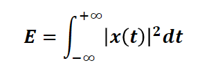
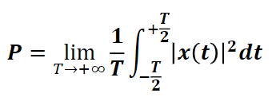

<iframe src="https://giphy.com/embed/3o84sq21TxDH6PyYms" height="150" frameBorder="0" class="giphy-embed" allowFullScreen></iframe>

Les premières grandeurs que l’on peut calculer sur un signal sont **l’énergie** et **la puissance**. 

- **L’énergie** d’un signal n’est pas la même énergie que celle en physique conventionnelle, bien qu’elles soient très liées. 

> Les signaux à énergie finie sont **physiquement réalisables**.

- **La puissance** permet d’exprimer la quantité d’énergie transférée par unité de temps. La puissance sera donc **nulle** pour les signaux à **énergie finie** .

