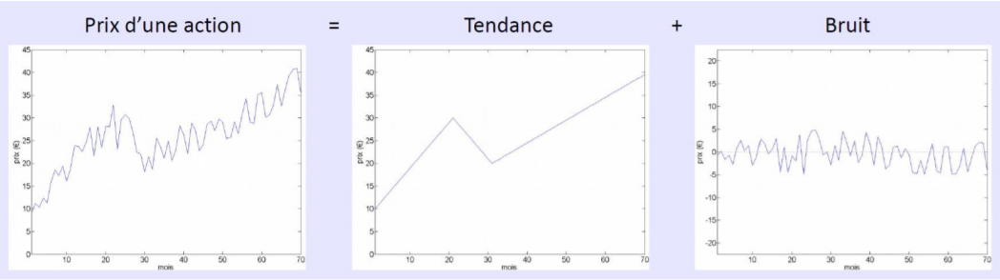

<iframe src="https://giphy.com/embed/snrDtXJBEiZwY" height="150" frameBorder="0" class="giphy-embed" allowFullScreen></iframe>

Un  signal  peut  souvent  avoir  des irrégularités  et  imperfections,  des  parasites non  **porteurs d’information** qui peuvent gêner son étude. C’est ce qu’on appelle le **bruit**. 

Un des buts du traitement du signal est aussi de parvenir à contrôler et éliminer ce bruit afin d’obtenir un signal le plus propre possible. Par exemple, pour reprendre l’exemple de la finance, sur le cours d’une action, on peut nettoyer le signal pour en **extraire le bruit et une tendance propre**.

