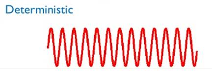
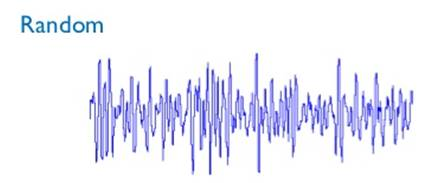

<iframe src="https://giphy.com/embed/xT0xeJpnrWC4XWblEk" height="150" frameBorder="0" class="giphy-embed" allowFullScreen></iframe>

Il  est  possible  de  rencontrer  2  classes  de  signaux,  les  signaux **déterministes** et  les  signaux **aléatoires**.

- **Les signaux   déterministessont**   les signaux que nous pouvons parfaitement représenter    mathématiquement    par une  fonction f(t),  ainsi  on  **connaît  sa valeur pour toute valeur de t (temps)**.

- Les **signaux aléatoires** au contraire, sont des  signaux  qu’on  ne  peut  pas représenter mathématiquement, on  ne **peut pas connaitre leur valeur à chaque instant**.

> Par exemple, le prix d’une action est un signal aléatoire,  on  ne  peut  pas  connaitre  son  prix  futur  car  le  signal  ne  suit  aucun  modèle mathématique fixe.
