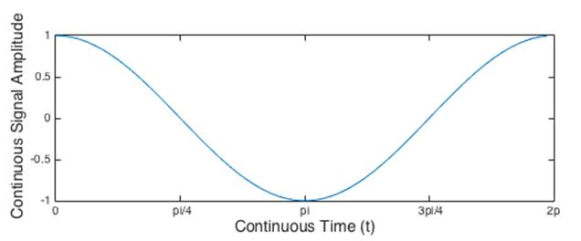
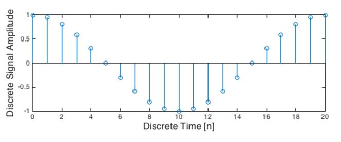
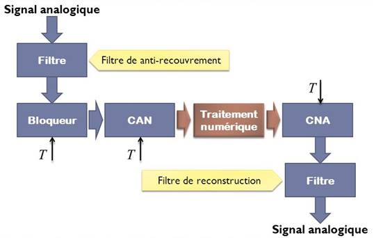

<iframe src="https://giphy.com/embed/12n5MNdTPHGMoM" height="150" frameBorder="0" class="giphy-embed" allowFullScreen></iframe>

Les signaux peuvent avoir 2 formes, ils peuvent être **continus** ou **discrets**.

- Le principe de continuité d’un signal est le même que le principe de continuité mathématique, les **signaux continus** sont des signaux définis à **chaque instant t**, où t est une variable continue/réelle. 

> Les signaux analogiques, comme la tension d’un réseau électrique sont des signaux continus.

- Un **signal discret** quant à lui n’est pas définit à chaque instant t mais de façon ponctuelle à **chaque intervalle de temps**. 
Si on relève la température à l’aide d’un capteur toutes les minutes, le signal obtenu sera discret.

Dans le traitement du signal et plus particulièrement l’étude du signal, on utilise très souvent des outils informatiques. 
Cela pose un problème pour étudier les signaux continus, car ceux-ci représentent une quantité d’information infinie puisque qu’ils sont définis à chaque instant. Tout signal continu doit donc être converti en signal discret pour être traité informatiquement.

> On parle de conversion depuis d’un signal analogique (continu) en signal numérique (discret). 

> Après un traitement informatique l’opération inverse existe également (Numérique vers Analogique).

On retrouve ces principes dans la chaine de traitement numérique du signal. 

