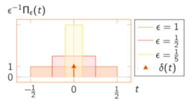

<iframe src="https://giphy.com/embed/3o6ZtcNYKiOxO7yVfq" height="150" frameBorder="0" class="giphy-embed" allowFullScreen></iframe>

Un fois les principes de base du traitement du signal posés, cela devient très mathématique. Dans les différentes opérations on utilise souvent des signaux usuels tels que le signal « échelon unitaire » / « Heaviside » Γ(𝑡) ou le signal « rectangle centré » Π𝑇(𝑡).

**Heaviside Γ(𝑡):**
")

**rectangle centré Π𝑇(𝑡):**
")

Vient ensuite le Dirac, ce n’est pas réellement un signal, mais un outil mathématique très utilisé dans le traitement du signal, notamment dans l’échantillonnage.
Il peut être vu comme la limite de plusieurs signaux carrés de largeur 𝜖 d’amplitude 1/𝜖 et dont l’aire est égale à 1.

Il est défini par plusieurs formules et propriétés mathématiques.