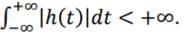

<iframe src="https://giphy.com/embed/du0sbc7pnFWq4" height="150" frameBorder="0" class="giphy-embed" allowFullScreen></iframe><p></p>

Un système est un ensemble d’éléments fonctionnels interagissant entre eux et qui établit un lien de cause à effet entre ses signaux d’entrée et de sortie. 

## Notion de linéarité

```
 x1(t) --[SLIT]--> y1(t)
 x2(t) --[SLIT]--> y2(t)
```

```
 a*x1(t)+b*x2(t) --[SLIT]--> a*y1(t)+b*y2(t)
```

## Invariance temporelle

Si on applique un décalage temporel en entrée alors le même décalage sera présent en sortie. La réponse du système est invariance par translation dans le temps => le système est alors invariant dans le temps.

```
 x1(t) --[SLIT]--> y1(t)
 x1(t-τ) --[SLIT]--> y1(t-τ)
```

## Caractérisation des SLIT

La réponse d’un système à une entrée sous forme d’impulsion de Dirac est appelée réponse impulsionnelle. Celle du SLIT est h(t).

Elle caractérise le SLIT dans le domaine temporel. Les systèmes physiques réels sont causaux, c’est-à-dire que la sortie du système ne peut pas varier avant que l’on ait appliqué l’entrée. 
Pour un SLIT causal on a h(t) = 0 pour t<0.

### Produit de convolution

**Notation :** 
```
 x1(t) --[SLIT]--> y1(t)
 x2(t) --[SLIT]--> y2(t)
```

**Définition :**  Soient deux fonctions f et g. Le produit de convolution de f et g est définie par : 
```
 x1(t) --[SLIT]--> y1(t)
 x2(t) --[SLIT]--> y2(t)
```

###  Propriétés du produit de convolution


**Commutativité**
```
 f(t)*g(t) = g(t)*f(t)
```
**Associativité**
```
 e(t)*f(t)*g(t) = e(t)*(f(t)*g(t)) = (e(t)*f(t))*g(t)
```

Distributivité par rapport à l’addition : 
```
 e(t)*(f(t)+g(t)) = e(t)*f(t)+e(t)*g(t)
```

L’élément neutre du produit de convolution est l’impulsion de Dirac et il est possible de faire des translations temporelles en convoluant sa fonction avec un Dirac retardé.

**Réponse :** La réponse y(t) d’un système S à une entrée x(t) est la convolution de x(t) avec la réponse impulsionnelle h(t) du système. 


## Stabilité d’un système SLIT
On dit qu’un système est stable si sa sortie est bornée lorsque son entrée est bornée. La condition sur h(t) pour que y(t) soit bornée est que:


> Un système est **stable si et seulement si** sa **réponse impulsionnelle est intégrable**. 
