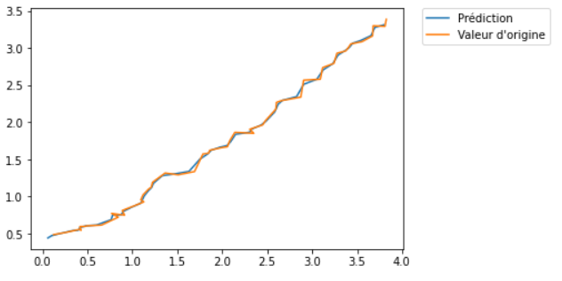

## Configuration

```python
from numpy import *
from numpy.linalg import inv, det
from numpy import random
from numpy import dot
```

## Prédiction

Cette étape doit prédire la moyenne X et la covariance P de l’état du système au moment k.
La fonction Python kf_predict effectue la prédiction de X et P en prenant en compte 6 input.

On a :

- **X** : la moyenne estimée du système à l’étape précédente i.e k-1
- **P** : La covariance du système à l’étape précédente
- **A** : La matrice n*n de transition
- **Q** : La matrice de covariance du bruit du processus
- **B** : Matrice d’effet de l’input
- **U** : Input de contrôle

Ainsi le code Python de la prédiction est :

```python
def kf_predict(X, P, A, Q, B, U):
    X = dot(A, X) + dot(B, U)
    P = dot(A, dot(P, A.T)) + Q
    return(X,P)
```

## Mise à jour

Au moment k, cette mise à jour calcule la moyenne postérieure X et la covariance P de l’état du système en prenant en compte une nouvelle mesure Y. La fonction Python kf_update effectue la mise à jour de X et P donnant les matrice X et P prédites, le vecteur Y, la matrice H de la mesure et la covariance R de la mesure. 

On a donc les input suivants :
- **K** : la matrice de Gain de Kalman
- **IM** : la moyenne de la distribution prédite de Y
- **IS** : la covariance de Y
- **LH** : La probabilité de mesure, qui est donnée par la fonction gauss_pdf

Ainsi on a le code Python suivant :

```python
def gauss_pdf(X, M, S):
    if M.shape[1] == 1:
        DX = X - tile(M, X.shape[1])
        E = 0.5 * sum(DX * (dot(inv(S), DX)), axis=0)
        E = E + 0.5 * M.shape[0] * log(2 * pi) + 0.5 * log(det(S))
        P = exp(-E)
    elif X.shape[1] == 1:
        DX = tile(X, M.shape()[1])- M
        E = 0.5 * sum(DX * (dot(inv(S), DX)), axis=0)
        E = E + 0.5 * M.shape[0] * log(2 * pi) + 0.5 * log(det(S))
        P = exp(-E)
    else:
        DX = X-M
        E = 0.5 * dot(DX.T, dot(inv(S), DX))
        E = E + 0.5 * M.shape[0] * log(2 * pi) + 0.5 * log(det(S))
        P = exp(-E)
    return (P[0],E[0]) 
```

```python
def kf_update(X, P, Y, H, R):
    IM = dot(H, X)
    IS = R + dot(H, dot(P, H.T))
    K = dot(P, dot(H.T, inv(IS)))
    X = X + dot(K, (Y-IM))
    P = P - dot(K, dot(IS, K.T))
    LH = gauss_pdf(Y, IM, IS)
    return (X,P,K,IM,IS,LH)
```

# Application numérique

Comme il a été expliqué plus tôt, le domaine d'application le plus intéressant du filtre de Kalman, dans les télécommunications, est la localisation d'un utilisateur mobile connecté à un réseau sans fil. 

Dans cette section, nous présenterons un algorithme simple de suivi d'un utilisateur mobile qui se déplace dans une pièce et qui est connecté à au moins trois antennes sans fil.   

La matrice de mesure Y décrit la position estimée du mobile à l'aide d'un algorithme basé sur une estimation des moindres carrés et la connaissance d'au moins trois valeurs de l'heure d'arrivée (ToA) au temps k. Ces valeurs sont calculées à l'aide de procédures de télémétrie entre le mobile et les trois antennes.  

En commençant par une initialisation de différentes matrices et en utilisant les matrices mises à jour pour chaque étape et itération, il faut la trajectoire estimée et réelle de l'utilisateur du mobile, et les mesures effectuées par la trilatération basée sur les moindres carrés. Nous montrons ici que le filtre de Kalman améliore la précision de la trajectoire par rapport à l'estimation statique basée sur les moindres carrés.  

En appliquant le code Python du filtre de Kalman donné dans le cours, trouvez et tracer la trajectoire prédite de l’utilisateur.  Afin de simplifier la compréhension de ce code, nous dessinons la matrice Yrandomly centrée sur la valeur réelle de la position du mobile.

### Initilisation

```python
#time step of mobile movement
dt = 0.1 

# Initialisation des matrices 
X = array([[0.0], [0.0], [0.1], [0.1]])
P = diag((0.01, 0.01, 0.01, 0.01))
A = array([[1,0, dt, 0], [0,1,0,dt],[0,0,1,0],[0,0,0,1]])
Q = eye(X.shape[0])
B = eye(X.shape[0])
U = zeros((X.shape[0],1))

# Matrice de mesure 
Y = array([[X[0,0]+ abs(random.randn(1)[0])], [X[1,0]+abs(random.randn(1)[0])]])
H = array([[1,0,0,0],[0,1,0,0]])
R = eye(Y.shape[0])

# Nombre d'itérations dans le filtre de Kalman 
N_iter = 50
```

### Réponse attendue

