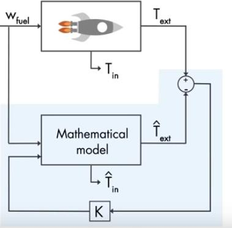
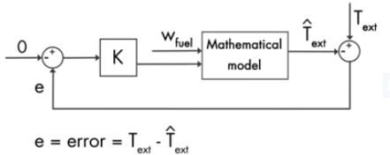
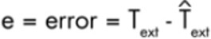
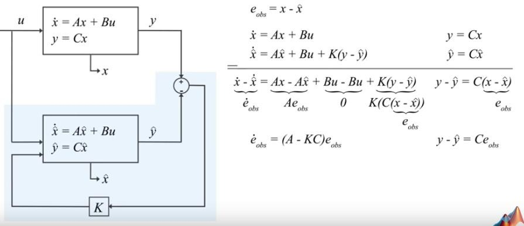
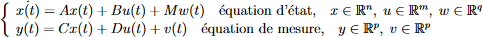
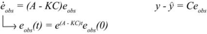
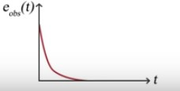

Le filtre de Kalman est un filtre à réponse impulsionnelle : type de filtre électronique caractérisé par une réponse fondée sur les valeurs du signal d’entrée ainsi que les valeurs antérieures de cette même réponse.

Le filtre de Kalman est un algorithme d’estimation optimale.Voici deux exemples qui illustrent l’usage du filtre de Kalman.

Dans le premier exemple nous allons voir que le filtre de Kalman sert à estimer l’état d’un système indirectement :

## Premier exemple

Prenons l’exemple d’une fusée qui part dans l’espace. L’hydrogène liquide est un combustible qui doit être chauffé à température extrême (3000°C). Il faut ainsi faire attention car une température trop grande peut causer un disfonctionnement des composantes de la fusée. Afin d’éviter cela, il est important de réguler la température du moteur. 

Peut-être me diriez-vous qu’il suffit simplement d’y placer un capteur ? La tâche n’est pas aussi simple car n’oublions pas que la température à l’intérieur du moteur peut atteindre les 3000°C et ainsi faire fondre un capteur placé en son sein. Il faut donc placer le capteur dans un endroit moins chaud comme une paroi extérieure. 

Vous l’aurez compris, le but est donc d’estimer la température interne du moteur tout en ayant des données sur la température extérieure du moteur. Le filtre de Kalman permet la meilleure estimation de la température interne à partir d’une mesure indirecte, telle que la température extérieure.

## Deuxième exemple

Dans un deuxième exemple, nous allons voir que le filtre de Kalman est utilisé dans des objets du quotidien comme le GPS : 

Afin de se localiser, un GPS est composé d’une centrale à inertie (instrument capable d’intégrer les mouvements d’un mobile, accélération et vitesse angulaire pour estimer son orientation, sa vitesse linéaire et sa position) ; un odomètre (instrument de mesure permettant de connaître la distance parcourue par un véhicule) ; récepteur GPS qui reçoit les signaux satellites afin de localiser le véhicule. 

Cependant, le signal GPS est faible dans les tunnels, en effet il est difficile de localiser la voiture dans un tunnel étant donné que les signaux GPS sont bloqués, la position peut également être biaisée de part les perturbations du au bruit et l’accumulation d’erreurs de mesure. Il faut donc se fier à la centrale à inertie du GPS qui nous donne l’accélération de la voiture. Nous savons que pour calculer une position à partir de l’accélération, il suffit d’effectuer une double intégrale. 

Cependant, la tâche n’est pas si simple car les erreurs d’estimation s’accumulent avec le temps, ce qui donne une position trop approximative. Dans ce cas, le filtre de Kalman peut être utilisé afin d’unir les trois instruments de mesure et
donner la meilleure estimation de la position exacte de la voiture.
 
## Approfondissment de son fonctionnement

Reprenons l’exemple de la fusée et voyons plus en détail comment on peut appliquer un
estimateur dans ce cas précis :

Voici un schéma de l’exemple utilisé le schéma réel (au-dessus) est accompagné d’un schéma mathématique. Le but est donc de reproduire un schéma mathématique ayant des valeurs approximées ^T*ext* et ^T*in* le plus proche possible des valeurs réels : on cherche à réduire

Nous allons nous intéresser plus particulièrement au modèle mathématique : Wfuel : quantité de carburan
- K : contrôle d’erreur
- T*ext* : température extérieure réelle
- ^T : température approximée

> Le but est, avec K, de contrôler les mesures que nous avons de trouver un modèle mathématique qui nous permet d’avoir T*ext* - ^T = 0, permet de contrôler l’erreur
 

 
En remplaçant les données par le modèle de Kalman, on a :

Pour rappel, le modèle de Kalman est défini comme suit :
 

On a vu que w(t) et v(t) sont des Gaussiennes centrées. I.E elle suivent une loi normale telle que : w(t) -> N(0, sigma) et v(t) -> N (0, epsilon)

Ainsi on a la solution suivante :

On note que Si (A-KC) < 0 alors si e(obs) -> 0 ou e(obs)-> infini on a ^x -> x

Comme il a été énoncé plus tôt, le filtre de Kalman sert à estimer l’état d’un système à partir d’une série de mesures incomplètes ou bruitées. Ainsi, en tant qu’estimateur, le filtre de Kalman est de plus en plus utilisé en finance.

Notamment pour prévoir la volatilité:
La volatilité est une mesure de la dispersion d’un prix (sa variation au cours du temps) est très utile pour le pricing et l’évaluation du risque. 

> Une société qui, depuis 20 ans, a une volatilité relativement faible cad qu’elle a des rendements plutôt réguliers sera (à moins d’un krach boursier ou d’une crise, effondrement de la société) aura moins de risque de voir le prix de son action chuter ou monter très vite par rapport à une PME qui a une marche de progression beaucoup plus importante.