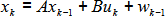
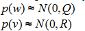
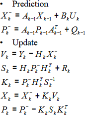

Avant tout, le filtre de Kalman est essentiellement un set d’équations mathématiques qui implémente un estimateur de type prédicteur-correcteur optimal. En effet, il vise à minimiser la covariance de l’erreur estimée en prenant en compte des conditions présumées.

Pour tout x ∈ ℜ n le processus x suit l’équation stochastique suivante :

Avec la mesure y*k* = Hx*k* + v*k*
Les variables aléatoires wk et vk représentent respectivement le processus ainsi que la mesure du bruit. Ils sont indépendants l’un de l’autre, blanc et suivent la loi normale suivante :

Ainsi, le filtre de Kalman se compose de deux étapes : la prédiction, où on prédit l’état du suivant du système en fonction des mesures précédents, et l’étape de mise à jour, où l’on estime l’état actuel du système en fonction de la mesure du moment.

Les étapes se traduisent par les équations suivantes :

Où :
- X*k*' et P*k*' sont les prédictions de la moyenne et de la covariance du système au moment k avant d’avoir vu la mesure.
- Xk et Pk sont les estimations de la moyenne et de la covariance du système au moment k après avoir vu la mesure.
- Yk est la moyenne de la mesure au moment k Vk est la mesure résiduelle au moment k
- Sk est la covariance de la mesure de prédiction au moment k
- Kk nous informe à quel niveau les prédictions doivent être corrigées au moment k
