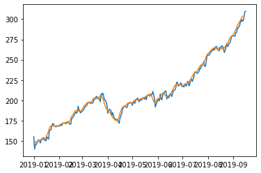

## importation

> Pour avoir le template du TP faites **Copier sur Drive** depuis ce lien : [Google Colab](https://colab.research.google.com/github/MarcEtienneDartus/Financial-Processing-Lab/blob/master/moving_average.ipynb)

## Mise en place des bibliothèques

``` python
import pandas as pd
import numpy as np
import datetime
import pandas_datareader.data as web
import matplotlib.pyplot as plt
```

## Mise en place des données

**A faire :**
- On defini les dates de début et de fin de notre échantillon
- On récupère les données de yahoo via la fonction `web.datareader`
- On récupère les prix de cloture du marché sous forme de liste

## Mise en place du filtre à moyenne mobile

**A faire :**
- Mettre en place la fonction moyenne_mobile()

```python
def moyenne_mobile(liste, ordre):
    pass
```

## Mise en application du filtre à Moyenne mobile

**A faire :**
- Récuperer la moyenne mobile de notre asset
- Afficher le graph de la moyenne mobile superposé aux prix de l'asset

> Les ranges de données ne sont pas de la même taille, plus l'ordre de votre moyenne mobile est grand plus l'écart entre le nombre data et la moyenne sera important.

**Résultat:**

