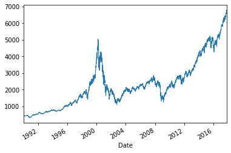
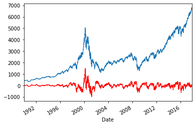
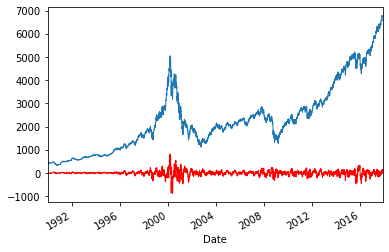
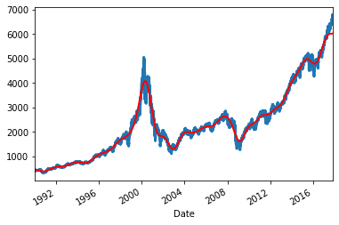
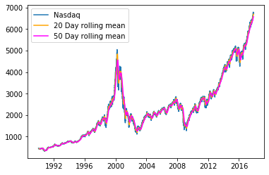

## Introduction
Les filtres linéaires jouent un rôle fondamental dans le traitement du signal. Avec un filtre linéaire, on peut extraire des informations significatives d'un signal numérique.

Dans cet exercice, nous allons montrer plusieurs exemples utilisant des données boursières (la bourse NASDAQ). Tout d'abord, nous appliquerons un filtre passe-haut à la série temporelle d'origine pour extraire les variations rapides. Par la suite, nous allons lisser un signal très bruyant avec un filtre passe-bas pour extraire ses variations lentes. Pour finir nous regarderons la méthode de la moyenne mobile pour voir les période de changement de variation.


Voici quelques liens qui pouront être utiles:
- [Documentation de pandas](https://pandas.pydata.org/docs/getting_started/basics.html)
- [Documentation de matplotlib](https://matplotlib.org/tutorials/introductory/usage.html##sphx-glr-tutorials-introductory-usage-py)
- [Documentation de scipy](https://docs.scipy.org/doc/scipy/reference/tutorial/index.html)

## Importation

> Pour avoir le template du TP faites **Copier sur Drive** depuis ce lien : [Google Colab](https://colab.research.google.com/github/MarcEtienneDartus/Financial-Processing-Lab/blob/master/filter_nasdaq.ipynb)

**Importation des librairies:**

``` python
import numpy as np
import scipy as sp
import scipy.signal as sg
import pandas as pd
import matplotlib.pyplot as plt
%matplotlib inline
```

**Importation du fichier CSV**


``` python
from google.colab import files
files.upload()
```

**Parser les données de date**


```python
nasdaq_df = pd.read_csv('nasdaq.csv',index_col='Date',parse_dates=['Date'])
date = nasdaq_df.index
nasdaq = nasdaq_df['Close']
```


## Exercice 1: Afficher les données du fichier

Le but est de voir si les données ce sont bien importées et de découvir le contenu du fichier.

**A faire :** afficher les données du csv

**Résultat attendu :**

<div>
<style scoped>
    .dataframe tbody tr th:only-of-type {
        vertical-align: middle;
    }

    .dataframe tbody tr th {
        vertical-align: top;
    }

    .dataframe thead th {
        text-align: right;
    }
</style>
<table border="1" class="dataframe">
  <thead>
    <tr style="text-align: right;">
      <th>Date</th>
      <th>Open</th>
      <th>High</th>
      <th>Low</th>
      <th>Close</th>
      <th>Adj Close</th>
      <th>Volume</th>
    </tr>
  </thead>
  <tbody>
    <tr>
      <th>1990-01-02</th>
      <td>452.899994</td>
      <td>459.299988</td>
      <td>452.700012</td>
      <td>459.299988</td>
      <td>459.299988</td>
      <td>110720000</td>
    </tr>
    <tr>
      <th>1990-01-03</th>
      <td>461.100006</td>
      <td>461.600006</td>
      <td>460.000000</td>
      <td>460.899994</td>
      <td>460.899994</td>
      <td>152660000</td>
    </tr>
    <tr>
      <th>1990-01-04</th>
      <td>460.399994</td>
      <td>460.799988</td>
      <td>456.899994</td>
      <td>459.399994</td>
      <td>459.399994</td>
      <td>147950000</td>
    </tr>
    <tr>
      <th>1990-01-05</th>
      <td>457.899994</td>
      <td>459.399994</td>
      <td>457.799988</td>
      <td>458.200012</td>
      <td>458.200012</td>
      <td>137230000</td>
    </tr>
    <tr>
      <th>1990-01-08</th>
      <td>457.100006</td>
      <td>458.700012</td>
      <td>456.500000</td>
      <td>458.700012</td>
      <td>458.700012</td>
      <td>115500000</td>
    </tr>
  </tbody>
</table>
</div>


## Exercice 2: Afficher le graphique

Le but est d'avoir un premier aperçu de l'évolution de la valeur de cloture du NASDAQ.

**A faire :** afficher la courbe de la valeur de cloture

**Résultat attendu :**





## Exercice 3: Filtre passe haut

### Partie 1

Le but est d'appliquer un filtre passe-haut, en utilisant 1 cycle/an comme fréquence de coupure. Grâce à cela, nous pouvons éliminer les variations lentes du prix du graphique. Cela signifie que seules les variations de prix survenues plus rapidement qu'un cycle par an seront affichées. Nous pouvons identifier les périodes de moindre volatilité lorsque le prix filtré se rapproche de 0.

**A faire :** faire le filtre passe haut et afficher les courbes

**Aide:** [Scipy function](https://docs.scipy.org/doc/scipy/reference/generated/scipy.signal.butter.html)

**Résultat attendu :**




### Partie 2

Nous pouvons aussi utiliser une fréquence de coupure plus élevée. Dans ce cas, les informations peuvent être utilisées pour du trading à haute fréquence ou des investissements à court terme.

**A faire :** faire le nouveau filtre passe haut et afficher les courbes

**Aide:** [Scipy function](https://docs.scipy.org/doc/scipy/reference/generated/scipy.signal.butter.html)

**Résultat attendu :**



## Exercice 4: Filtre passe bas

Le but est d'essayer la stratégie inverse: au lieu d'isoler les variations à grande vitesse du prix actuel, nous pouvons utiliser un filtre passe-bas pour éliminer les changements à grande vitesse. Le résultat est une courbe lissée, dans laquelle nous pouvons facilement identifier la tendance des valeurs locales. Plus la fréquence de coupure est basse, plus la présence de variations de courte durée sera faible.


**A faire :** faire le filtre passe bas et afficher les courbes

**Aide:** [Scipy function](https://docs.scipy.org/doc/scipy/reference/generated/scipy.signal.butter.html)

**Résultat attendu :**




## Exercice 5 : Moyenne mobile

Le but est d'utiliser la "moyenne mobile". Elle est l'un des indicateurs les plus courants des prix historiques. Il consiste à calculer la valeur moyenne d’un nombre limité d’échantillons de temps autour d’un point et à «déplacer» la fenêtre temporelle le long de l’ensemble des données. Les points de croisement entre des courbes de différentes tailles de fenêtre indiquent des changements de tendance. Cependant, il s'agit clairement d'un indicateur retardé qui fournit lui-même des informations tardives.

**A faire :** faire deux moyenne mobile avec un pas de 20 et 50 puis afficher les courbes

**Aide:** [Pandas function](https://pandas.pydata.org/pandas-docs/stable/reference/api/pandas.DataFrame.rolling.html)

**Résultat attendu :**


