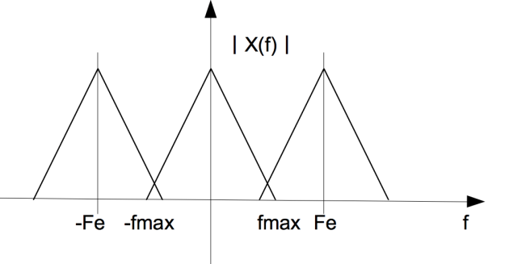
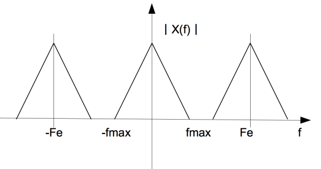

<iframe src="https://giphy.com/embed/l3mZasrfwrWUMnndS" height="150" frameBorder="0" class="giphy-embed" allowFullScreen></iframe>

La condition nécessaire et suffisante pour échantillonner un signal sans perte d'information est que la fréquence d'échantillonnage Fe soit supérieure ou égale au double de la fréquence maximale du signal. 

> Plus précisément, si on note Fmax la fréquence maximale du signal, il faut et il suffit que f*e* ≥ 2f*max*. 

Si nous supposons que le signal s(t) possède un spectre borné tel que S(f)=0 si f n’appartient pas [−f*max*, f*max*], nous voyons que le spectre du signal échantillonné sera non recouvert si la condition f*e* ≥ 2f*max* n’est pas vérifiée.  

> Par exemple, si l'on veut numériser le signal analogique qui possède une bande passante s'étendant entre 300 et 3400 Hz. 
> **Quelle doit être la fréquence d'échantillonnage minimum ?** 
> La formule du théorème de Shannon nous montre que la fréquence d'échantillonnage doit être supérieure au double de la fréquence maximum (3400Hz), soit 6 800 Hz. 

**Pourquoi cette propriété est importante ?**

Si est **trop faible**, alors les répliques recouvrent le motif initial ce qui se traduit par une **distorsion du spectre** et par conséquent **une perte irréversible d'information**. C'est le cas de la figure ci-dessous.  

A cause du chevauchement des motifs constituant le spectre X*e*(f) du signal échantillonné, il n'est pas possible de récupérer le spectre X(f) par un filtrage approprié. Il n'est donc pas possible de reconstruire le signal initial x(t) à partir de la connaissance de son échantillonné x*e*(t).  

