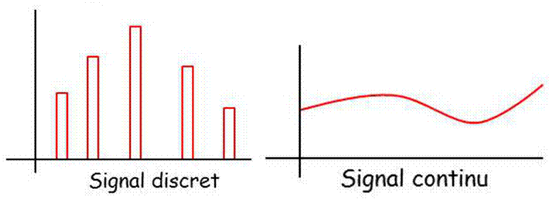

<iframe src="https://giphy.com/embed/XD4qHZpkyUFfq" height="150" frameBorder="0" class="giphy-embed" allowFullScreen></iframe>

Dans un **signal continu**, l’amplitude et le temps sont des **variables continues**, c’est-à-dire sans points de **discontinuité**. Inversement, dans un **signal discret**, l’amplitude et le temps sont des **variables discontinues**. Le signal n’existe qu’en des **instants bien déterminés**. 

## L'échantillonnage d’un signal continu 

L'échantillonnage est une opération qui consiste à transformer un signal analogique en un signal numérique. 
Cette opération est fondamentale en traitement de signal car à l’issue de l’opération le signal obtenu étant numérique, il est possible de le traiter au moyen d’un ordinateur. 

Il s’agit donc au cours de cette opération de passer d’un signal continu s(t) d’une variable t quelconque à une suite d’échantillons {s(n)} avec n ∈ N. 

Cette opération est réalisée au moyen d’un convertisseur analogique numérique (C.A.N.). 
Le C.A.N prend au cours de cette opération les valeurs de s(t) à intervalles réguliers Te.

> L’intervalle choisi est par définition la période d'échantillonnage qui est notée Te. L’inverse de cette quantité est appelé fréquence d'échantillonnage fe. 

Si un signal s(t) est échantillonné à la fréquence fe sur un intervalle T alors le signal échantillonné sera de dimension finie et contiendra N = T /Te échantillons. 

Pour un signal numérique de dimension infinie, la conversion analogique numérique peut être appréhendée mathématiquement en utilisant la distribution peigne de Dirac. Il suffit d’appliquer la distribution peigne pour passer de s(t) à {s(n)} 
